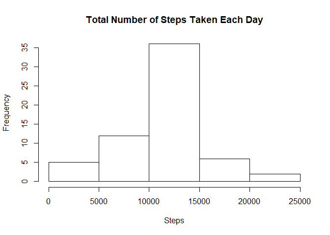

## Set working directory 

```r
setwd("C:/Users/Y/Desktop/Coursera/Data Science/5Reproducible Research/Week2/Project/RepData_PeerAssessment1")
```

## Download data if not download before

```r
if(!file.exists("activity.zip")){
  url<-"https://d396qusza40orc.cloudfront.net/repdata%2Fdata%2Factivity.zip"
  download.file(url,destfile = "activity.zip")
}
```

## Unzip file if not unzip before

```r
if(!file.exists("activity.csv")){
  unzip("activity.zip") 
}
```

## Loading and preprocessing the data

```r
data<-read.csv("activity.csv")
data$date<-as.Date(data$date)
```

## What is mean total number of steps taken per day?

```r
data.step.per.day<-aggregate(data$steps,list(data$date),sum,na.rm=TRUE)
colnames(data.step.per.day)<-c("date","steps")
hist(data.step.per.day$steps,
     main="Total Number of Steps Taken Each Day",
     xlab="Steps")
```

<!-- -->

```r
step.per.day.mean<-mean(data.step.per.day$steps)
step.per.day.median<-median(data.step.per.day$steps)
```
1. The mean of the total number of steps taken per day is 9354.2295082.
2. The median of the total number of steps taken per day is 10395.

## What is the average daily activity pattern?

```r
data.daily<-aggregate(data$steps,list(data$interval),mean,na.rm=TRUE)
colnames(data.daily)<-c("interval","steps")
with(data.daily,plot(interval,steps,type="l"))
```

<!-- -->

```r
max.step<-max(data.daily$steps)
max.interval<-data.daily[which(data.daily$steps==max.step),c("interval")]
```

The maximun steps are 206.1698113, which happen at the 835 interval.

## Imputing missing values

```r
na.total<-sum(is.na(data$steps))
```
The total number of missing values in the dataset is 2304.

Using the mean of the 5-minute interval fill in the missing data, create a new data frame called data.filled. 

```r
data.filled<-data
for (i in 1:nrow(data.filled)){
  if(is.na(data.filled[i,c("steps")])){
    data.filled[i,c("steps")]<-data.daily[which(data.daily$interval==data.filled[i,c("interval")]),c("steps")]
  }
}
data.filled.step.per.day<-aggregate(data.filled$steps,list(data.filled$date),sum,na.rm=TRUE)
colnames(data.filled.step.per.day)<-c("date","steps")
hist(data.filled.step.per.day$steps,
     main="Total Number of Steps Taken Each Day",
     xlab="Steps")
```

<!-- -->

```r
filled.step.per.day.mean<-mean(data.filled.step.per.day$steps)
filled.step.per.day.median<-median(data.filled.step.per.day$steps)
```
1. The mean of the total number of steps taken per day of the data set with NA values filled in is 1.0766189\times 10^{4}.
2. The median of the total number of steps taken per day of the data set with NA values filled in is 1.0766189\times 10^{4}.
3. Filling in NA values increases the frequency of the bin of 10000-15000 for the total steps per day. Both of the mean and median of the total step per day increase compared to the original data. 

## Are there differences in activity patterns between weekdays and weekends?

```r
data.filled$weekday<-weekdays(data.filled$date)
data.filled[weekdays(data.filled$date) %in% c("Monday", "Tuesday", "Wednesday","Thursday","Friday"),c("weekday")]<-"weekday"
data.filled[weekdays(data.filled$date) %in% c("Saturday", "Sunday"),c("weekday")]<-"weekend"
library(ggplot2)
ggplot(data.filled, aes(interval,steps)) +  
  geom_line() + 
  facet_grid(weekday~.) 
```

<!-- -->
